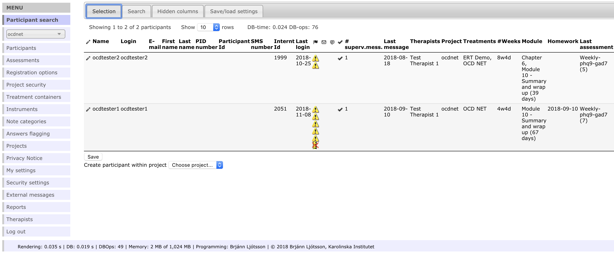
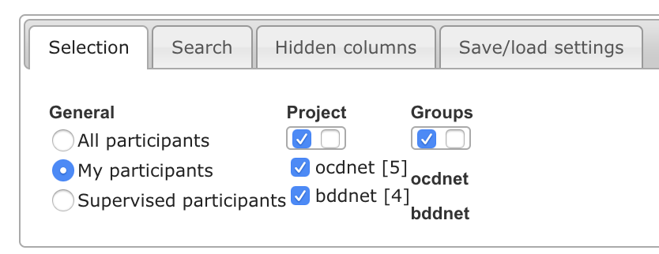
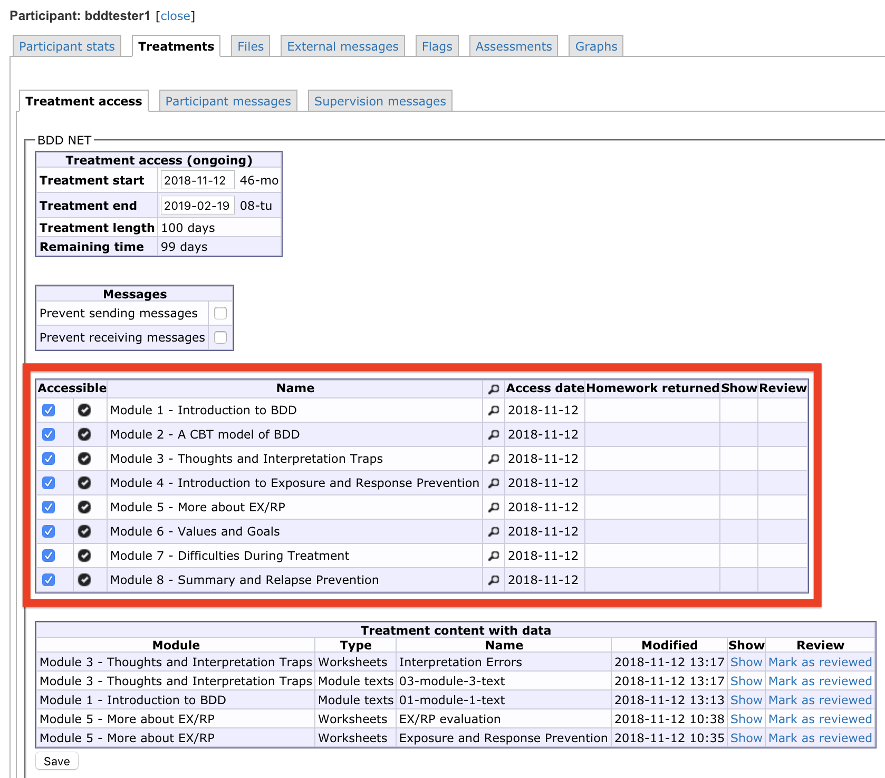

# Web-CBT therapist manual {#webcbt-therapist}

## Quick start

If you want to explore the platform yourself, you can use test therapist and test patient logins provided to try out the features (separate document). We generally recommend that you use the platform while reading this manual, to test features as you go along.

## Using the platform

There are five common scenarios during the course of treatment:

- Responding to messages
- Reviewing homework
- Opening new treatment modules
- Reviewing questionnaires
- Responding to warning flags

These actions can all be accessed in the participant overview, shown below:

A typical day as a therapist includes responding to one or more messages, reviewing homework and opening up a new module. Once in a while you will write to remind an inactive patient or assess a warning flag. 

**Quick note: We use Participant and Patient as synonyms here.**

### Navigation

You will be using the platform from the *Participant search* menu 99% of the time. If you get lost while using the platform, click *Participant search* to get back to the default view. When you want to access individual participants, click the pencil next to their name.

This menu may expand depending on your administrative rights. Other parts of the menu include administrative settings such as editing treatment content, editing assessments, changing the way flags appear, and changing settings to the site itself. These will not be relevant to most therapists and we do not cover them in detail here. Just remember that you can always go back to the default view by navigating to *Participant search* in the left-hand menu.

### Filtering the participant overview

To get a quick overview, you can filter patients that are relevant to you. If you look at the top of the participant overview, there is a button called *Selection*. We recommend that therapists use the "My participants" filter to show only patients assigned to them.

You can also filter patients by project (for example OCD-NET or BDD-NET), groups (for example "In treatment" or "post-treatment").

### Writing and responding to messages

Written messages are the main form of communication—and often the only communication—between therapist and patient in internet-based CBT. Care and attention to messages should be applied accordingly[^ Writing effective messages in internet-based CBT—as any form of writing—is a difficult skill to master that requires practice. General advice on writing often applies here as well. We have found that feedback from colleagues is often as useful as standardised guidelines. Some quick tips though: read your message aloud to spot mistakes and complicated sentences, be as concise as possible, and save questions or action points to the end of your message.].

When you log onto the platform, a new message from a patient will be indicated by this icon turning red . Navigate to *Treatments -> participant messages* to view the message and write your response.

### Homework review

A completed homework assignment is shown in the **Homework** column in the participant overview. Click the pencil next to the participant and navigate to *Treatments -> Treatment access* to review the homework and mark it as completed.

Internet-based CBT relies heavily on self-directed activities and homework review is a good time to check whether the patient has grasped important concepts and are able to apply them to their own situation.

### Treatment modules

When a patient has read a module and completed the corresponding homework assignment(s), they are ready for the next module. Grant access to a new module by navigating to *Treatments -> Treatment access* and checking the box next to the next module. A date will appear next to the module indicating when the module was activated. Patients automatically get a text message when you open up a new module.

The number of modules and weeks in treatment varies but a rough guideline is that patients should progress through one module per week. Some treatment techniques, like exposure with response prevention in obsessive compulsive disorder, are spread out across several modules to emphasise their importance and iron out wrinkles that many patients experience.

While it is certainly satisfying to see that a patient has fully grasped a concept in treatment, therapists are advised against requiring perfect answers. Patients getting stuck on a certain module may feel less motivated to continue treatment, so choose revisions wisely. Older modules are always available to review throughout treatment.

### Questionnaires

Before, during, and after treatment, patients are asked to fill out questionnaires. When new questionnaires are activated they appear as the patient logs onto the platform. You can review and change which questionnaires should appear at which day in *Assessments* but we recommend that you stick to the standard schedule whenever possible.

### Warning flags

The Web CBT platform will display a *warning flag* next to a patient's name for certain events. The most common flags are due to inactivity or non-response to questionnaires. These serve as prompts to therapists to take further action, for example reaching out by phone to a patient or sending them another text message reminder.

Once you have noticed a warning flag and started to deal with it, you may indicate your action in the *temporary flag text* box in the *Participant stats* tab (shown below). Please note, however that inactivity flags automatically disappear once then patient uses the platform again.

#### Common warning flags
* Patient has not logged in for 7 days: 
* Patient has not written a message in 7 days: 
* Patient has not responded to measurement in time: 
* Patient has no assigned therapist: 
* Treatment ends within 1 week: 
* Treatment has ended: 

#### Suicidality warning flags

The most important type of warning flag is due to heightened suicidality. We have configured the platform to display this flag if a patient responds 4 or higher on the suicidality question in MADRS-S.

* Warning flag to indicate suicidal ideation: 

*Local clinical guidelines may overrule the general course of action outlined here.*

1. Call the patient immediately
2. Explain that it is standard procedure to call when a patient indicates heightened suicidal ideation
3. Follow a hierarchy of questions, such as M.I.N.I. interview, to assess level of suicidality
4. If the immediate risk is low (i.e. MADRS-S score of 4), make an agreement to check back in with the patient in a few days and give them contact information to the nearest 24-hour psychiatric care unit
5. If the immediate risk is high (i.e. MADRS-S score of 5-6), advise the patient to seek immediate help at your centre or at a 24-hour psychiatric care unit.

Once the level of suicidality is deemed to be low enough to not require further attention, you may remove the warning flag under the *Flags* tab for the participant.

### Supervision

Supervision through the platform makes it easy to connect feedback from the supervisor to specific therapist messages and actions. The supervision page is found at *Treatment -> Supervision messages* for each participant. 

### Assign new therapist

The most typical scenario is that each patient is treated by one therapist throughout treatment, but it is not uncommon for a second therapist to act as backup if the primary therapist is not available.

To assign another therapist or change therapist, navigate to the patient in question and click the *Participant stats* tab. At the bottom of that page, you will see a list of therapists and those assigned to the patient will have a checkmark next to them. Simply un-check whoever is to be removed and check whoever is to be assigned the patient.

### Create new patient login

To create a new patient login on the platform, go to the participant overview by selecting *Participant search* in the left-hand menu. Select *Create new participant* at the bottom of the participant list.

Fields not needed are:

* Participant ID: Internal ID for the platform. Usually not needed.
* Password: New patient logins are created without passwords. The first time the patient logs onto the platform they will be asked to generate a password
* Temporary flag text: Usually not needed at creation but might come in handy later for communicating between therapists
* Temporary notes: Usually not needed

## Technical support for patients

We have designed the platform to be user-friendly for patients with varying technical know-how. They will, however, require technical support from time to time. Here we review the most common issues that patients might have and how to solve them. If patients report technical issues that you cannot address yourself, send an email to <ocdnet.support@webcbt.se> and ask for assistance.

### Forgotten username or password

If a patient has forgotten their password, they can request a new one at the login screen:

If they have forgotten their username, simply look at their *Participant stats* and **Login** is their username.

If a patient is unable to generate a new password on their own, navigate to the patient in question and the *Participant stats* tab. There is a button to clear password or change password, we recommend the *Change password* option.

**Clear password:** The password is removed and the user will not be able to use their previous password. You will have to generate a new one by clicking *Change password*.

**Change password:** The site generates a new, secure, password that you can send to the patient via SMS. You might want to save the new password as a temporary note (the box below the *Change password* button) in case the password is lost again.

### The website does not work

This is usually for one of three reasons: wrong information (URL/username/password), the patient is using an out of date web browser, or there is an issue with cookies on the site.

#### Wrong URL/username/password

Make sure that the patient has correct information for all three. Also make sure that you have not made errors when entering the username!

- URL is [webcbt.se/ocdnet](webcbt.se/ocdnet)
- Username is indicated by "Login" at *Participant stats*
- Their password is hidden to you and can be re-generated by patients themselves or by therapists (see above)

#### Recommended web browsers

The treatment is accessible for both desktop web browsers and mobile web browsers (iOS, Android). We recommend that patients use either **Google Chrome**, **Firefox**, or **Safari**. We do not recommend **Internet Explorer** or **Microsoft Edge**, although newer versions of those browsers usually work just fine.

#### Cookies and cache

Sometimes the browser will save cookies that interfere with access to the treatment platform. We recommend that patients clear cookies and restart their web browser.

- [Google Chrome](https://support.google.com/chrome/answer/95647?co=GENIE.Platform%3DDesktop&hl=en)
- [Firefox](https://support.mozilla.org/en-US/kb/delete-cookies-remove-info-websites-stored)
- [Safari desktop](https://support.apple.com/kb/ph21411?locale=en_US)
- [Safari iOS](https://support.apple.com/en-gb/HT201265)

## Technical support for therapists

### Creating an account

Send an e-mail to us <ocdnet.support@webcbt.se> containing the following information:

* Username
* Full name
* e-mail
* Phone number (to receive login codes via text messages)

We then create a user for you and generate a password that you replace on your first login.

### Forgotten password

Admins are able to reset therapist passwords in the *Therapist* tab of the left-hand menu. Click the button called "Must change password" to initiate a password change for that user.

### Other technical issues

Have you spotted an error in the treatment content? Are the questionnaires not displaying correctly? Did you accidentally make some changes that you are not able to change back? 

Anything else that is not reviewed in this guide, please let ut know by sending an e-mail to us (ocdnet.support@webcbt.se) and we will help you.

We strive to improve the treatment content and the experience for therapists continuously and welcome any feedback!