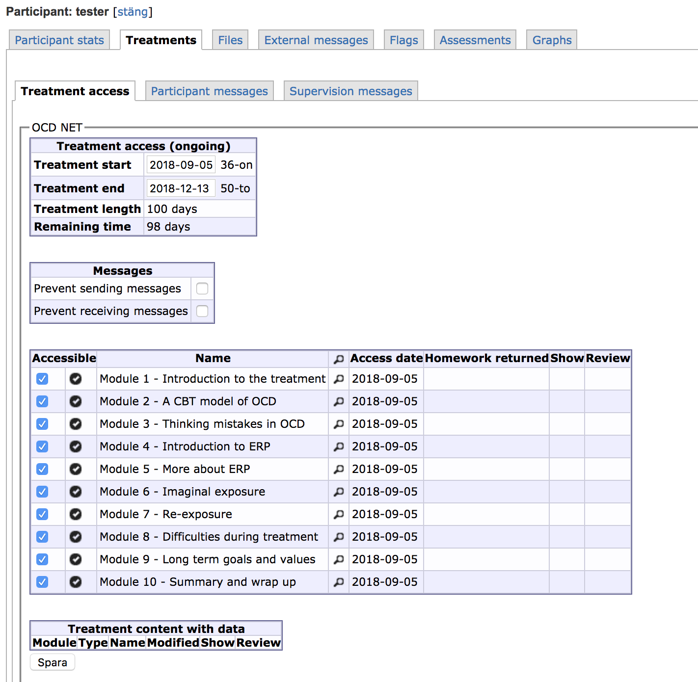

# OCD-NET therapist manual

Write a kind introduction here.

## What is OCD-NET?
OCD-NET is a therapist-guided internet-based cognitive behaviour therapy for OCD developed by researchers at Karolinska Institutet in Stockholm, Sweden. OCD-NET has been evaluated in six clinical trials to date with results indicating that it is as effective as regular face-to-face CBT, while requiring less therapist time per patient and with the advantage of being accessible from any device connected to the internet [@andersson2011a; @andersson2012; @andersson2014a; @andersson2015a; @ruck2018].

OCD-NET is a therapist-guided treatment, which means that patients have an identified therapist throughout treatment that provides support and feedback along the way. OCD-NET is internet-based, and all contact with the therapist occurs through the treatment platform as asynchronous text messages (like e-mail or SMS).

{width=500px}

The treatment in OCD-NET is based on established treatment protocols for OCD [@foa2012], and focuses on exposure with response prevention. This means that patients do most of the active treatment work away from their computer or mobile device, for example when they are performing exposure and response prevention exercises.

### Who is suitable for OCD-NET
OCD-NET has been developed to treat adult patients with OCD. In the trials that have evaluated OCD-NET to date, participants have had comorbid conditions such as depression and anxiety, while autism spectrum disorder, psychotic symptoms and substance use disorder have been exclusion criteria.

The intended use of OCD-NET is within a stepped-care model where patients are offered low-intensity treatments as a first step, [see the NICE-guidelines](https://www.nice.org.uk/guidance/CG31/chapter/1-Guidance#stepped-care-for-adults-young-people-and-children-with-ocd-or-bdd). We therefore recommend that OCD-NET is primarily used for patients with mild to moderate symptom severity without comorbid autism spectrum disorder, psychotic symptoms, or substance use disorder.

### Presenting OCD-NET as an option to the patient
It is important that participating in internet-based treatments such as OCD-NET and BDD-NET is voluntary. Forcing someone to undertake a treatment they do not agree with is unhelpful at the very least and can also be harmful.

With that in mind, we believe there are two particularly strong arguments for the use of OCD-NET rather than face-to-face therapy: patients can access the treatment content and therapist therapist support whenever they want to, and treatment can start right away rather than after a waiting time.

We have also found that many patients like to contribute to research and the development of new treatments. For example, most patients will see the benefit of evaluating remote treatment options.

Other suggestions:
* Write your first message on the first day of treatment to welcome the patient and notify them of ways to contact you with questions
* Provide encouragement throughout treatment to motivate the patient and establish a therapeutic working alliance

### Modules in OCD-NET
There are 10 modules in OCD-NET, which patients are expected to complete in 12 weeks. Each module consists of texts and uses well established evidence based interventions for OCD, with exposure and response (ERP) prevention being the core intervention. To progress to the next module participants have to complete homework assignments (such as reading text material, answering a quiz at the end of each module, filling out worksheets, or doing ERP) and report to their therapist.

{width=500px}

We view modules 1, 2, 4, and 5 as the core modules in OCD-NET. Modules 1 and 2 are essential since the OCD diary and CBT model of OCD are the building blocks for understanding and doing ERP later on. Modules 4 and 5 should be presented in rapid succession so that patients can start doing ERP as quickly as possible. It is not crucial to have a detailed plan for each ERP exercise before starting, rather you should encourage patients to get started and fine-tune ERP exercises as they go along.

Modules 3 and 6 are optional. Module 3 (thinking mistakes) is useful for some patients but is not necessary for most. Module 6 (imaginal exposure) is crucial to some patients who might not be able to do *in vivo* ERP exercises, but not relevant to others who will rely solely on *in vivo* ERP exercises. A key difference in module 6 compared to other modules on exposure is that imaginal exposure should not be seen through the lens of habituation. We do not expect--or want--that a patient will habituate to the thought of being a pedophile, for example. Rather, imaginal exposure can be helpful as a tool to learn that having a thought or image is not the same as acting that way, and to tolerate uncertainty.

The number of completed modules is not an important predictor of treatment outcomes in OCD-NET. As long as patients reach modules 4-5 and perform ERP exercises, the later modules are not essential and can opened if needed. Patients will gain access to all modules at the end of treatment, and will be able to log onto the platform for one year after completing the OCD-NET treatment. Your most important job during the active treatment phase is therefore to encourage the patient to do ERP exercises and help them to design and evaluate ERP exercises effectively.

Modules 6-9 can be opened in any order to fit the needs of each patient. For example, a patient might not have any use of imaginal exposure but finds that they have a hard time refraining from habitual compulsions. In that case, you may open up module 7 (re-exposure) instead of module 6 (imaginal exposure). Other patients may struggle with ERP exercises and will find module 8 (difficulties during the treatment) useful.

## Being an effective ICBT therapist
Being a therapist in OCD-NET differs in several ways from regular face-to-face treatment. The first difference is the mode of communication: asynchronous text messages rather than live face-to-face talking. The second is that you are more closely integrated in the treatment content, and will rely more heavily on material that is already written. Third, there is less therapist oversight when patients do exposure exercises. We discuss the implications of these differences, and some strategies to have in mind, below.

### Communicating through written messages
From the participant's point of view, your messages will look like text messages on a phone. This is deliberate, as such a design encourages short and frequent messages rather than long messages that are few and far between.

#### Keep your messages short
Messages should be concise and to the point. Refer the patient to module text whenever possible. Your main use of the messages should be to provide encouragement and reinforce key behaviours such as registering obsessions and compulsions in the OCD diary and performing ERP exercises. To this end, you can allow yourself longer messages related to the OCD diary where you highlight examples that the patient has given and relate them to the CBT model of OCD. One common strategy to reinforce ERP exercises is to connect them to the long-term goals that the patient has decided on.

#### Write often
Frequent communication is particularly useful at the start of treatment and when patients start doing ERP exercises. This establishes the habit of logging onto the platform daily, and ensures that patients start doing exposure exercises which are challenging and likely to be avoided without your encouragement.

As a minimum, therapists should write to patients once every 2-3 days to check in, but several messages per day can be useful when patients start doing ERP exercises. For example, you may confirm an exposure exercise in the morning and check in during the afternoon for a follow-up. There are exceptions to this rule: some patients will prefer to do ERP exercises on their own and will not have many questions for you. This is perfectly fine; some patients benefit greatly from the OCD-NET content without the therapist support.

### You and the rest of the content in OCD-NET
Your communication with the patient is integrated with the rest of OCD-NET. What feels like a low-intensity contact from your perspective is actually a **highly intensive treatment** for patients. They not only respond to your messages but also read module texts, answer homework questions and questionnaires, and fill in worksheets. The treatment becomes particularly intensive once patients start performing daily ERP exercises. Do not be fooled by the seemingly low-intensity treatment from your point of view; OCD-NET is a highly intensive treatment for patients.

### Lack of therapist-guided exposure exercises
We do not have the privilege of guiding patients through ERP exercises in OCD-NET. This means that you will have to focus on the essentials when giving corrective feedback and when planning ERP exercises. Correcting every little detail before each exercise is counter-productive. Rather, we want to reinforce the behaviour of challenging their OCD through ERP exercises. OCD-NET therapists should therefore encourage patients to get started and gain new experiences. Wrinkles can be ironed out along the way.

## Dealing with patients with low engagement
The best way to deal with low engagement is to prevent it from happening to begin with. Strategies to prevent low engagement include writing frequently and focusing on encouragement in your written messages, promptly calling patients that do not respond to messages, and helping patients design their first ERP exercises to get early experiences of the treatment procedures in action.

If a patient becomes less active on the treatment platform, it does not necessarily mean that they are not actively working with the treatment or have given up on the treatment. Some inactive patients are actually doing a lot of treatment work in their daily life but do not report it. Others are early responders that have grasped the treatment strategies quickly and experienced symptom reductions early in treatment. Even with these exceptions, there are certainly occasions when a patient struggles to adhere to the treatment.

### Strategies when patients express lack of time to work on the treatment
One common reason for low engagement is that patients struggle to find the time to work on OCD-NET. We recommend that you encourage any small steps the patient takes and that you prioritise ERP exercises away from the computer over reading additional modules.

If a patient is completely unable to work on the treatment, try to schedule a point to check back in to resume treatment or help the patient problem-solve around other events that may interfere with working on the treatment.

### Strategies when patients express skepticism about OCD-NET
Some patients may initially be skeptical about OCD-NET in general or in their ability to do a fully remote treatment like OCD-NET. We recommend that therapists validate the feelings of frustration that can come from any attempt to change behaviour, and that therapists note that this as a common feeling early in treatment. Initially skeptical patients often change their opinion after doing ERP exercises that work, and we encourage therapists to help these patients experience *early wins* by starting with easier ERP exercises that have a high likelihood of success.

## Closing remarks
We hope that you have found this therapist guide useful. Our goal has been to present a few ideas about how to deliver OCD-NET effectively. These are just the first building blocks and you will likely find that adaptations are needed to your particular patients and your own style as a therapist.

We strive to continuously update and improve this material and would appreciate any feedback. You can reach us at <ocdnet.support@webcbt.se> or talk to us in person at a training session.

## Appendix: Theoretical basis for remote treatments such as OCD-NET
In **learning theory**, obsessions can be seen as conditioned stimuli (CS) that elicit a conditioned response (CR) in the form of fear/anxiety. The CR then serves as a discriminant stimulus to perform a compulsion (operant behaviour). The compulsion relieves anxiety in the short-term but maintains the CS-CR relation and compulsions remain a likely response in the future [@mowrer1960].

**Cognitive theories of OCD** stipulate that beliefs about the *meaning* of obsessive thoughts is the key difference between individuals with and without OCD. For example, if a person believes that having aggressive thoughts are dangerous because it increases the risk of aggressive behaviour, they are more likely to appraise aggressive thoughts as highly negative and rely on compulsions to reduce the anxiety [@salkovskis1985].

Classic conditioning (obsessions are associated with a fear response), operant conditioning (compulsions persevere because they reduce the fear associated with obsessions), and cognitive factors (obsessive beliefs) form the cognitive-behavioural model of OCD [@abramowitz2009].

{width=400px}

The cognitive-behavioural model of OCD fits some patients well, but other psychological mechanisms may contribute to OCD that deserve mention here. The first is cognitive inflexibility, such as deficits in attention switching or task switching [@gruner2017]. This means that OCD-patients may struggle to change their behaviour after learning about the CBT model. Second, individuals with OCD rely on habitual learning mechanisms to a higher degree than others, which means that the compulsions are tightly ingrained as habits and it might take time to undo that learning and establish new goal-directed behaviours [@gillan2014; @voon2014].

What, then, is the role of the therapist in remote treatments such as OCD-NET? We see two core components: to help patients generalise the CBT model of OCD to their own particular situation, and to provide frequent positive reinforcement for exposure exercises. Exposure exercises done in the patients own *natural environment* are particularly useful as the new information is directly applicable and patients may not need therapist involvement in this setting [@emmelkamp1989].

We cannot be certain about the underlying psychological mechanisms that are important and influence behaviour change over time, so we focus on getting the patients started and they will learn along the way. The key here is that you as a therapist act as an antecedent and positive reinforcer to desired behaviours: using the CBT model for their own situation and performing exposure exercises.
